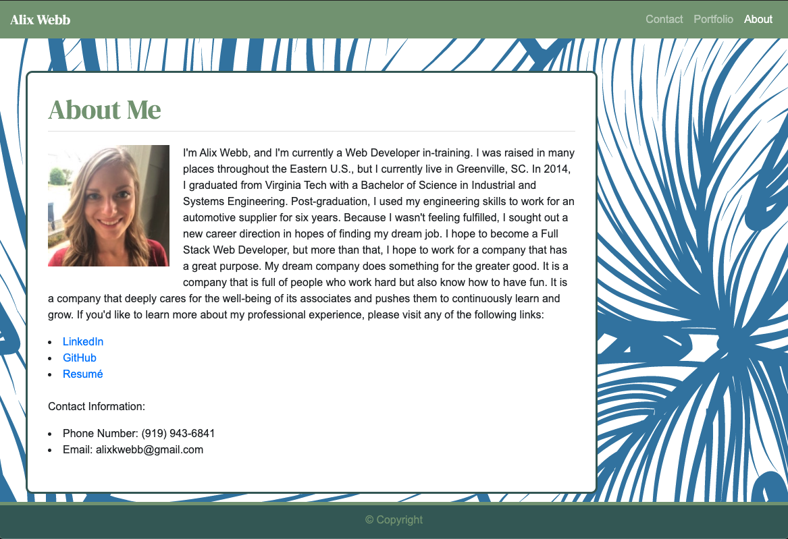

# my-react-portfolio

## The Repository
This site is stored in the "my-react-portfolio" repository on Alix's github account (username: awebb8). This repository is public. 
Link to repository: https://github.com/awebb8/my-react-portfolio
Link to deployed site: https://alix-react-portfolio.herokuapp.com/

## Project Goal
Create a personal portfolio website using react.

## My Responsive Portfolio

## About Me
The "About" page is a brief summary of myself.  It includes links to my personal LinkedIn and GitHub pages, a link to my resume, and a photo of myself.  The "About" page is accessible from all other pages through using the Navbar.

## Portfolio
The "Portfolio" page displays images of the homeworks and projects I have completed.  The "Portfolio" page is accessible from all other pages through using the Navbar.

## Contact
On the "Contact" page, site users can input their Name, Email, and a message in order to get in touch with me.  The "Contact" page is accessible from all other pages through using the Navbar.